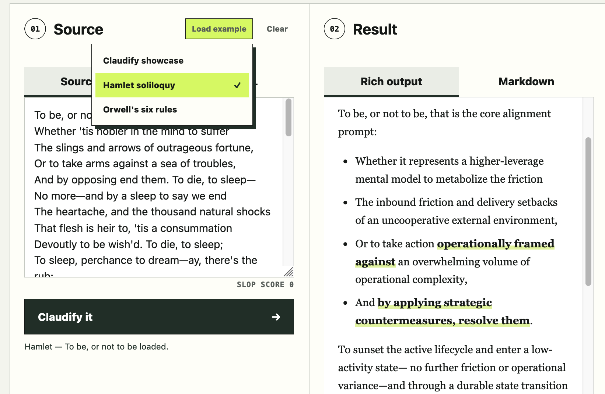

### Paste English prose. Make it Linked-in share-ready.

Writing falling flat?  Too predictable? 
Too polished - Too **human**?
[Claudify](https://blater.github.io/claudify/) helps your words speak the language of AI.

With a deterministic approach and no AI of its own, [Claudify](https://blater.github.io/claudify/) uses advanced linguistic heuristics to transform everyday prose into machine-engineered writing that captures the familiar patterns of Claude and other AI models.

It introduces the hallmarks readers have come to recognize: lexical clichés, marketing clusters, em dashes, the rule of three, passive constructions, and clusters of transitions. Need an unexpectedly strange word choice or an awkward turn of phase? [Claudify](https://blater.github.io/claudify/) can help


## Usage

Either paste your text into the "Source Text" edit box, or click on Source URL and choose a document on the web to load (may have limitations), and then click "Claudify it"

You can also load one of the example texts and try that. In this one we clean up a passage from stuffy old Hamlet and make it relevant for modern audiences.


_Writing takes work_. But it shouldn’t feel like hard labor. Relax and sit back while Claudify enslopifies for *you*.


## Run locally

```sh
npm test
npm run check
npm run serve
```
Then open <http://localhost:8000>. The Python command is a development convenience only: any static host works, and no application server runs in production. Native ES modules do not work reliably from `file://` URLs.

URL loading is best-effort and browser-only. Recognized public GitHub issue and pull-request URLs use the disclosed `api.github.com` adapter. Other URLs are fetched directly and remain subject to CORS, authentication, paywalls, and bot controls.

(1) Claudify is 250% vibe coded. The author has never seen the source code, thus has no opinion on it. Exposure may be associated with ocular discomfort and mild nausea
